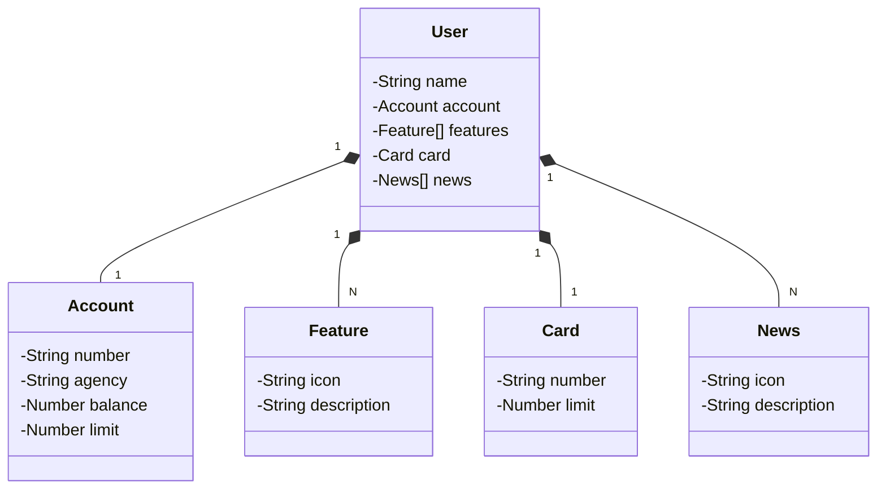

# Santander Dev Week 2023 Java API

RESTful API da Santander Dev Week 2023 construída em Java 17 com Spring Boot 3.

## Introdução

Bem-vindo ao repositório da API da Santander Dev Week 2023! Esta API foi criada para demonstrar a construção de uma aplicação RESTful robusta e moderna utilizando tecnologias Java avançadas.

## Tecnologias Principais

 - **Java 17**: Aproveitamos as vantagens das inovações mais recentes do Java para garantir um código moderno e eficiente.
 - **Spring Boot 3**: Utilizamos a última versão do Spring Boot para maximizar a produtividade do desenvolvedor e a premissa de autoconfiguração.
 - **Spring Data JPA**: Simplificamos o acesso aos dados através do Spring Data JPA, facilitando a integração com bancos de dados SQL.
 - **OpenAPI (Swagger)**: Criamos uma documentação de API abrangente e de fácil entendimento usando o OpenAPI (Swagger), integrado perfeitamente com o Spring Boot.
 - **Railway**: Facilitamos o deploy e o monitoramento na nuvem, além de aproveitar diversos serviços de banco de dados e pipelines de CI/CD.

## Diagrama de Classes (Domínio da API)

Abaixo está o diagrama de classes que representa o domínio da API:



## Organização de Pacotes

O projeto está organizado seguindo uma estrutura de pacotes que favorece a modularização e a clareza do código. Abaixo está a organização atual dos pacotes no projeto:

```bash
src/
 └── main/
     └── java/
         └── me.dio/
             ├── domain/
             │   ├── controller/
             │   │   ├── exception/
             │   │   │   └── GlobalExceptionHandler.java
             │   │   └── UserController.java
             │   ├── model/
             │   │   ├── Account.java
             │   │   ├── BaseItem.java
             │   │   ├── Card.java
             │   │   ├── Feature.java
             │   │   ├── News.java
             │   │   └── User.java
             │   └── repository/
             │       └── UserRepository.java
             ├── service/
             │   ├── impl/
             │   │   └── UserServiceImpl.java
             │   └── UserService.java
             ├── Application.java
             └── ...
```

A estrutura de pacotes foi projetada para facilitar a separação das responsabilidades e garantir a manutenção e escalabilidade do código. Cada pacote agrupa classes relacionadas e fornece uma visão clara da organização do projeto.

- O pacote **domain** contém as classes de modelo da API, como **User**, **Account**, **Card**, **Feature**, **News** etc.
- O pacote **controller** contém as classes responsáveis por receber e processar as requisições HTTP, incluindo o tratamento de exceções.
- O pacote **service** contém a lógica de negócios da aplicação, implementada na interface **UserService** e sua implementação **UserServiceImpl**.
- O pacote **exception** dentro do **controller** contém o manipulador global de exceções, **GlobalExceptionHandler**, para lidar com diferentes tipos de exceções de forma uniforme.
- O arquivo **Application.java** inicia a aplicação Spring Boot.

A estrutura de pacotes facilita a colaboração e a manutenção do código, tornando mais fácil para os desenvolvedores localizarem e modificarem partes específicas da aplicação.

## [Link do Figma](https://www.figma.com/file/0ZsjwjsYlYd3timxqMWlbj/SANTANDER---Projeto-Web%2FMobile?type=design&node-id=1421%3A432&mode=design&t=6dPQuerScEQH0zAn-1)

Utilizamos o Figma para abstrair o domínio da API, auxiliando na análise e projeto da solução.

## Instruções de Uso

Para executar a API em ambiente de desenvolvimento, siga os seguintes passos:

1. Clone este repositório.
2. Configure as variáveis de ambiente no arquivo **application-dev.yml**.
3. Execute o aplicativo Spring Boot utilizando sua IDE ou através da linha de comando.

## Importante

Este projeto foi construído com finalidade educacional para a Digital Innovation One. Caso queira explorar uma versão mais completa deste projeto, incluindo todos os endpoints CRUD e boas práticas, confira o repositório oficial da DIO:

### [digitalinnovationone/santander-dev-week-2023-api](https://github.com/digitalinnovationone/santander-dev-week-2023-api)

## Contribuição

Contribuições são bem-vindas! Sinta-se à vontade para abrir issues e pull requests para melhorar este projeto.